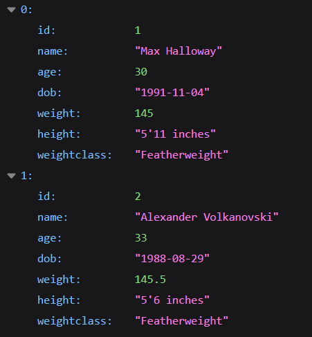
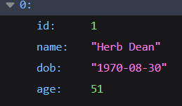
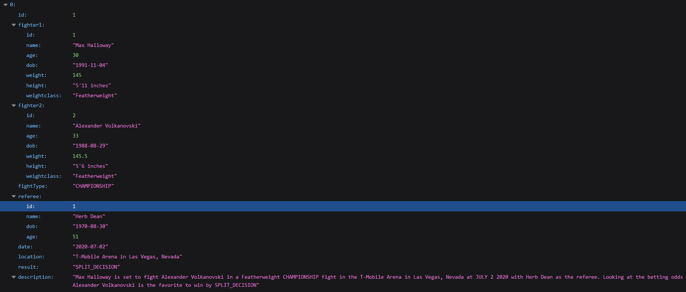

# SpringBootUfc
## Small SpringBoot Application I developed to add, update, get, and delete fighters, referees and even make fights. It does not go too much into depth, just developed to have fun.

## All Fighters
This is an example of a response of all fighters,

## All Referees
This is an example of a response of all referees,

## All Fights
This is an example of a response of all fights,

It will show the fighters, referee, location, fight type, and a description which includes prediction done by a function I developed to make predictions.